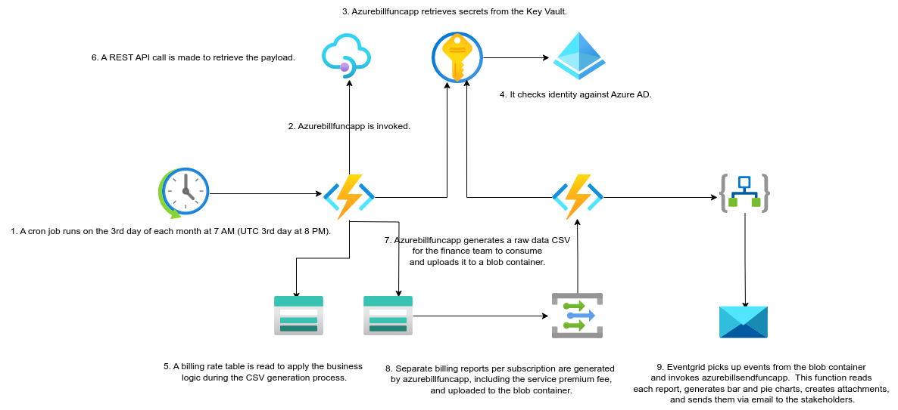
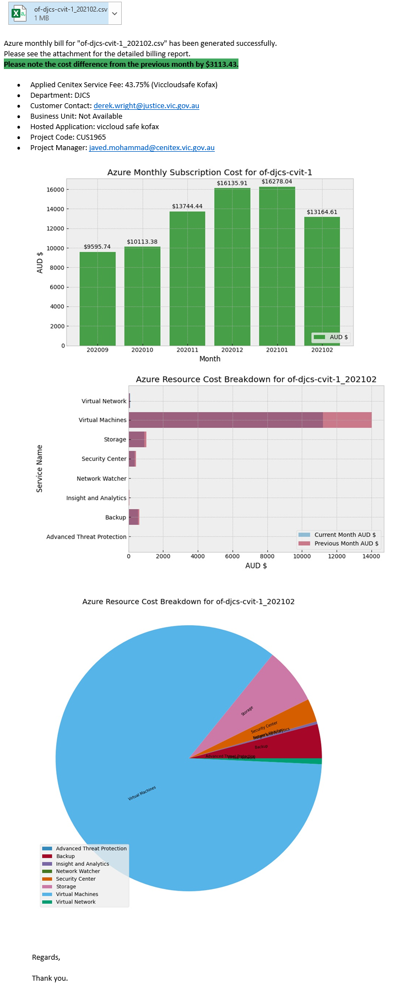

# VICGOV - Azure EA Billing Report Workflow

## Table of Contents
1. [Introduction](#1-introduction)
   1. [Overview](#11-overview)
2. [Logical Architecture](#2-logical-architecture)
   1. [Logical System Component Overview](#21-logical-system-component-overview)
3. [Output Email](#3-output-email)
   1. [Example Output](#31-example-output)

## 1. Introduction
### 1.1 Overview

The VICGOV - Azure EA Billing Report Workflow project was initiated to address outstanding Azure charges and resolve issues related to invoices under dispute. Hosting Platform Services has been collaborating with Customer Account Managers, Finance, and Business Technology teams to streamline the billing process.

This document provides a high-level overview of the workflow involved in automating the capture and generation of the bill. It also includes a detailed troubleshooting guide.

## 2. Logical Architecture
### 2.1 Logical System Component Overview

The logical architecture of the VICGOV - Azure EA Billing Report Workflow is as follows:

1. A cron job runs on the 3rd day of each month at 7 AM (UTC 3rd day at 8 PM).
2. Azurebillfuncapp @GSPINFRA03 is invoked.
3. Azurebillfuncapp @GSPINFRA03 retrieves secrets from the Key Vault.
4. It checks identity against Azure AD.
5. A billing rate table is read to apply the business logic during the CSV generation process.
6. A REST API call is made to retrieve the payload.
7. Azurebillfuncapp generates a raw data CSV for the finance team to consume and uploads it to a blob container.
8. Separate billing reports per subscription are generated by azurebillfuncapp, including the CTX service premium fee, and uploaded to the blob container.
9. Eventgrid picks up events from the blob container and invokes azurebillsendfuncapp. This function reads each report, generates bar and pie charts, creates attachments, and sends them via email to the General Managers (GMs).

## 3. Output Email
### 3.1 Example Output

